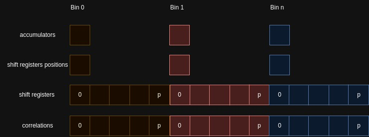
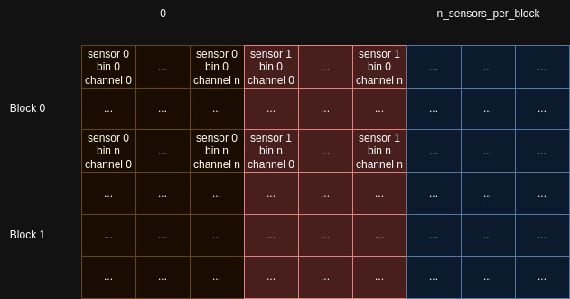

# AutocorrelationCUDA

> 
> Based on the previous work of [**Lapo Falcone**](github.com/Lapo9) and [**Gianpaolo Cugola**](github.com/cugola). The original work with a more in depth explaination can be found [here](github.com/Lapo9/AutocorrelationCUDA)
>
## Overview

This CUDA application is designed to efficiently calculate the autocorrelation function for a matrix of sensors using a multi-tau approach. It is specifically tailored for FCS data analysis, which is a powerful technique for studying the dynamics of fluorecent molecules in a solution.


## Features

- Fast computation of the autocorrelation function using CUDA parallel processing
- Support for processing a full time series or packets of data, allowing flexibility in data handling
- Customizable parameters to fine-tune the analysis for your specific experiment

## Requirements

Before using this application, make sure you have the following requirements:
- nvcc compiler

## Getting Started

### Building the Application

1. Clone the repository to your local machine
2. Make sure that the `ARCH` flags in the Makefile reflects your GPU architecture
3. Run the `make` command

### Running the Application

To calculate the autocorrelation, you need to provide your input data in a compatible format. The input data should be a matrix of sensors reading, where each column represents a sensor's time series data.

The application can be run using the following command:

``` console
./bin/main -p [PACKET_LENGTH] -l [NUM_BINS] -g [BIN_SIZE] -i [INPUT_FILE] -r -o [OUTPUT_FILE]
```

All the available flags are:
```
[--debug, -d]           Activate debug prints

[--results, -r]         Prints to stdout the results of the autocorrelation

[--packets, -p]         Number of instant used per packets

[--input_file, -i]      Name of the input file containing the sensor data
                        for the calculation of the autocorrelation

[--output-file, -o]     Name of the output file. Correlation result will be saved into a csv file

[--iterations, -I]      Number of times that the calculation is repeated. If it is greater than
                        one the calculation of the autocorrelation will be repeated multiple
                        times on the same data

[--sensors, -s]         Number of Sensors present in the matrix of sensors

[--groups, -l]          Number of bins used for each correlator of the sensor matrix

[--group_size, -g]      Size of the bins for each correlator

[--help, -h]            Print this help message
```
## Correlator Data Structure

The correlator data structure is designed with optimization in mind. Among the most crucial parameters are: __bin_size__ and __num_bins__. These parameters not only define the fundamental structure of the correlator but also grant the flexibility to achieve varying levels of accuracy in results and computation speed by adjusting their values.

- __shift_registers__: This array holds the actual sensor data that is inserted into the correlator.
- __correlations__: It stores the computed correlation results.
- __shift_register_positions__: This array keeps track of the positions where new values should be inserted for each bin. This aids in the shift procedure by enabling a round-robin approach, eliminating the need to shift the entire memory position of the array.
- __accumulators__: It contains values that are forwarded to the next bin in the correlator

This organization is shown in the following image:
<p align="center">

</p>

The memory layout for the __shift_registers__ and __correlations__ arrays is carefully arranged to minimize the potential for bank conflicts. Each thread, when calculating correlations, accesses a different memory bank, enhancing parallel processing efficiency. This design choice ensures that the CUDA Autocorrelation application makes the most of GPU capabilities.

The memory layout is visualized in the following diagram:

<p align="center">

</p>